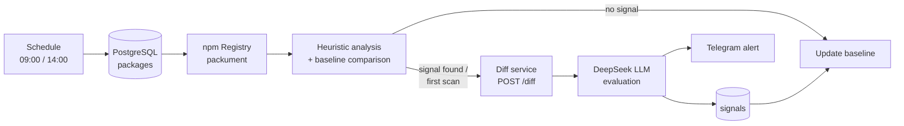

# npm Supply Chain Monitor

An automated monitoring system that detects signs of supply chain attacks in tracked npm packages. It compares each new release against a stored "baseline" version, scans for suspicious changes using rule-based heuristics, has an LLM (DeepSeek) evaluate the code diff, stores the findings in PostgreSQL and sends alerts via Telegram.

> This project was developed during my internship.

---

## What does it detect?

| Signal | Risk | Description |
|---|---|---|
| `integrity_mismatch` | 🔴 critical | The version number is unchanged but the tarball hash (`dist.integrity`) is different, which indicates that an already published package was tampered with. |
| `malicious_script_heuristic` | 🔴 / 🟠 / 🟡 | Suspicious patterns in install scripts: `curl \| bash`, base64-encoded payloads, `eval` / `new Function`, `child_process`, raw IP or `.onion` addresses, reading `process.env` combined with a network request |
| `publisher_change` | 🟠 high | The npm user who published the package has changed (possible account takeover) |
| `install_script_change` | 🟠 high | A `preinstall` or `postinstall` script was added or modified |
| `version_change` | ℹ️ info | A new version was published |
| `first_check_scan` | varies | Audit record created when a package is scanned for the first time |

For every package that produces a signal, the **code diff** between the two versions is extracted and sent to the LLM. The LLM enriches each signal with a status, category, severity, confidence level, root cause explanation and the suspicious code snippets.

---

## Architecture



The system has two components:

### 1. n8n workflow
- Runs twice a day (09:00 and 14:00).
- Processes the active packages in the `packages` table one by one, waiting 10 seconds between packages to respect rate limits.
- Fetches the latest metadata for each package from the npm registry: version, integrity hash, publisher and install scripts.
- Compares it with the baseline and runs the heuristic rules.
- If a signal is found or the package is being scanned for the first time, it calls the diff service and then has the LLM evaluate the result.
- Writes the signals to the `signals` table, deduplicated by `dedup_hash` so the same signal is not stored repeatedly.
- Sends a summary alert to Telegram and updates the baseline to the new version.
- If any step fails, the error is recorded in the `failed_scans` table and reported through a separate Telegram bot.

### 2. Diff service (`npm-diff-service/`)
An Express service that downloads two versions of an npm package and compares them.

- Downloads and extracts packages with `pacote`. Install scripts are **never executed**.
- Finds added, removed and changed files and produces unified diffs for text files. Diffs larger than 50,000 characters are not returned inline; they are written to a size-capped temporary store and referenced by a `diff_id`. Every changed file is still scanned for suspicious patterns.
- Identifies binary files by their magic numbers (PE, ELF, Mach-O, ZIP…) and scans the printable strings extracted from them.
- Scans all text and binary content for suspicious patterns: remote download commands, raw IP or Tor addresses, shell references, Discord/Telegram webhooks.
- Analyzes install script and dependency changes in `package.json`.
- Collects every finding into a single `security_signals` list so the workflow and the LLM get a compact summary.

**Security measures:**
- Authentication with an `x-api-key` header, compared in a timing-safe way.
- Strict validation of package names and versions. Only valid npm names and exact semver versions are accepted, which blocks specs such as git URLs, file paths or tarball URLs.
- DoS limits: at most 5,000 files and 200 MB per package, at most 10 MB per file for content scanning, and at most 3 concurrent requests.
- Error responses never leak internal details (file paths, stack traces) to the client.

---

## Setup

### Requirements
- Node.js 20.17+ (required by `pacote`)
- PostgreSQL
- n8n (self-hosted)
- DeepSeek API key
- Telegram bot token

### 1. Run the diff service

```bash
cd npm-diff-service
npm install
cp .env.example .env   # then set API_KEY
npm start
```

To generate a strong API key:

```bash
openssl rand -hex 32
```

The service listens on port `3000` by default (configurable with `PORT`). It refuses to start without `API_KEY`. If n8n runs on a different machine, expose the service through a tunnel (e.g. Cloudflare Tunnel) or a reverse proxy.

### 2. Prepare the database

Example schema for the tables used by the workflow:

```sql
CREATE TABLE packages (
  id                       SERIAL PRIMARY KEY,
  name                     TEXT NOT NULL UNIQUE,
  active                   BOOLEAN NOT NULL DEFAULT true,
  baseline_version         TEXT,
  baseline_integrity_hash  TEXT,
  baseline_install_script  TEXT,
  baseline_publisher       TEXT,
  baseline_updated_at      TIMESTAMPTZ
);

CREATE TABLE checks (
  id              SERIAL PRIMARY KEY,
  package_id      INT REFERENCES packages(id),
  version         TEXT,
  publisher       TEXT,
  integrity_hash  TEXT,
  checked_at      TIMESTAMPTZ DEFAULT now()
);

CREATE TABLE signals (
  id                      SERIAL PRIMARY KEY,
  package_id              INT REFERENCES packages(id),
  signal_type             TEXT NOT NULL,
  risk_level              TEXT,
  detail                  TEXT,
  dedup_hash              TEXT NOT NULL,
  ai_status               TEXT,
  ai_category             TEXT,
  ai_severity             TEXT,
  ai_confidence           TEXT,
  ai_root_cause           TEXT,
  ai_suspicious_snippets  JSONB,
  resolved                BOOLEAN NOT NULL DEFAULT false,
  detected_at             TIMESTAMPTZ DEFAULT now()
);

-- Prevents unresolved signals from being inserted twice
CREATE UNIQUE INDEX signals_dedup_open
  ON signals (package_id, signal_type, dedup_hash)
  WHERE resolved = false;

CREATE TABLE failed_scans (
  id             SERIAL PRIMARY KEY,
  execution_id   TEXT,
  package_id     INT,
  package_name   TEXT,
  failed_step    TEXT,
  error_message  TEXT,
  retry_count    INT,
  created_at     TIMESTAMPTZ DEFAULT now()
);
```

Add the packages you want to monitor:

```sql
INSERT INTO packages (name) VALUES ('express'), ('lodash'), ('axios');
```

### 3. Import the n8n workflow

1. In n8n, open `zafiyet_takip.json` via **Import from File**.
2. Create the following credentials and attach them to the corresponding nodes:
   - **Postgres**: database connection
   - **DeepSeek**: LLM API key
   - **Telegram**: alert bot and error bot
   - **Header Auth**: name `x-api-key`, value = your `API_KEY`; attach it to the `HTTP_DiffAPI` node
3. In the `loadConfig` node, set `http_tunel` to the `/diff` URL of your diff service.
4. In the `Telegram_SendAlert` and `Telegram_SendError` nodes, replace `YOUR_TELEGRAM_CHAT_ID` with your own chat ID.

---

## API

### `POST /diff`

**Header:** `x-api-key: <API_KEY>`

```json
{
  "package": "lodash",
  "from_version": "4.17.20",
  "to_version": "4.17.21"
}
```

`from_version` is optional. If it is omitted, the service runs in **first scan** mode and analyzes only `to_version`.

| `mode` | When |
|---|---|
| `first_check` | No `from_version`. All files of a single version are scanned. |
| `diff` | Two different versions are compared. |
| `same_version_requested` | Both versions are the same. In this case the integrity check is handled by the workflow. |

The `diff` response includes `summary`, `security_signals`, `files_added`, `files_removed`, `files_changed`, `large_files_changed`, `text_files_*`, `binary_files_*` and `package_json_analysis`.

**Error codes:** `400` invalid request · `401` missing or invalid key · `413` limit exceeded · `422` package/version not found or network error · `429` too many concurrent requests

---

## Environment variables

| Variable | Description |
|---|---|
| `API_KEY` | Access key for the diff service (required) |
| `PORT` | Port the service listens on (optional, default `3000`) |

---

## Project structure

```
.
├── npm-diff-service/
│   ├── server.js        # Diff service (Express)
│   ├── package.json
│   └── .env.example
├── zafiyet_takip.json   # n8n workflow (credentials removed)
└── README.md
```

---

## Known limitations and future work

- Only the `latest` dist-tag is tracked. Versions published under tags such as `next` or `beta` are not monitored.
- The heuristics are regex-based, so advanced obfuscation techniques can bypass them.
- The LLM evaluation is a supporting signal, not a final verdict. Critical signals should be reviewed manually.
- Diffs larger than 50,000 characters are stored on the service but there is no endpoint to fetch them yet; only their pattern scan result reaches the LLM.
- Text/binary classification relies on file extensions, well-known file names and a content check (NUL bytes / UTF-8 validity), so unusual encodings can be misclassified.
- Transitive dependencies are not scanned yet.
